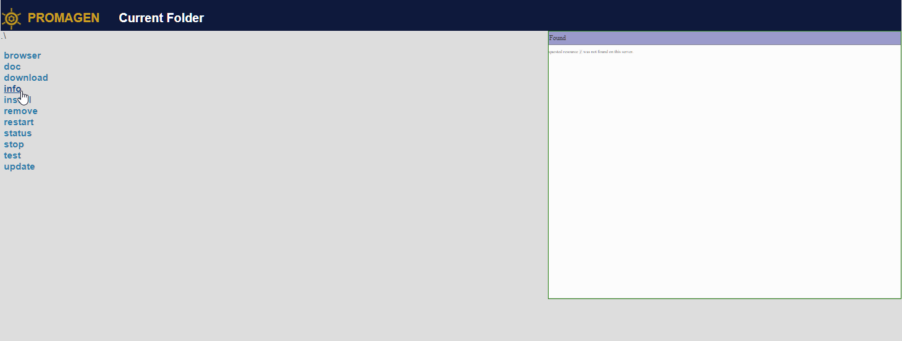
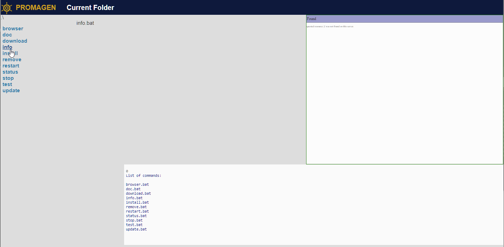

# www
ProMaGen Project
[www.promagen.com](https://www.promagen.com/)

## Menu

+ [Blog](https://blog.promagen.com/)

+ [Logo](https://logo.promagen.com/)

+ [Documentation](https://docs.promagen.com/)

+ [Example Application](https://app.promagen.com/)

## Versions

# One
Just for one Project,
executable file is inside the project,
without config file
+ [one](https://one.promagen.com/)
binary file for: linux, iOS or windows system

# Multi
For many projects
executable file is global for whole system
config file is depends project or user
+ [multi](https://multi.promagen.com/)

# Server
based on NodeJS
executed as nodeJS application

# Cloud
for creating space to execute some example scipts
based on faas.ovh/ faasapp.com
Cloud convert this html file with bash scripts in files few *.sh
which will be executed by One Promagen version on faasapp.com Cloud

https://docs.gitlab.com/runner/install/linux-manually.html

## How to start on windows?
Please use this dedicated project for windows environment:
[promagen/windows: Environment prepared to execute ProMaGen on windows OS](https://github.com/promagen/windows)

## required

+ git, https://gitforwindows.org/
+ nodejs

## Installation on windows

download using git command

    git clone https://github.com/promagen/windows.git promagen-win
    cd promagen-win

## start working with ProMaGen

    download.bat
    install.bat
    
    restart.bat

### start browser on  https://localhost:3001/
+ [ProMaGen One](https://localhost:3001/)

### start scripts on browser

## check in console

    doc.bat

    info.bat

## update

    update.bat

